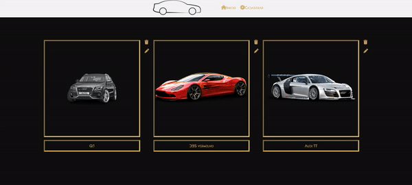

## Projeto da Blue-Edtech - Catálogo Super Carros

      

## Deploy do site
    
https://super-carros.onrender.com/    
         
## Detalhes

Projeto em sistema CRUD com banco de dados PostGreSql na nuvem. Arquiterura baseada em MVC ('Model', 'View', 'Controler'). Deploy no web server, Render (https://render.com/)

## Features

- [x] Pagina Inicial
- [x] Pagina Cadastrar
- [x] Pagina Detalhes
- [x] Pagina Editar
- [x] Função Delelar

## Stacks

    
    
    

 
 

    
    
    

 

    
    

## Contato

